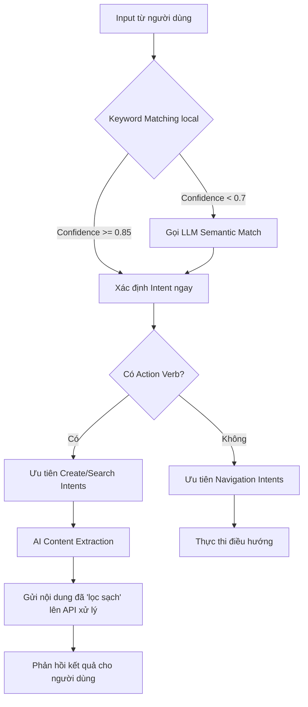

# Hệ thống Hybrid Intent Matching & Semantic Extraction

## 1. Tổng quan
Hệ thống được thiết kế để xử lý ngôn ngữ tự nhiên (NLP) một cách thông minh, kết hợp giữa tốc độ của **Keyword Matching** truyền thống và sự hiểu biết ngữ nghĩa sâu sắc của **Large Language Model (LLM)**.

Hệ thống giải quyết 3 thách thức chính:
1. **Phân loại ý định (Intent Classification)**: Hiểu người dùng muốn gì (tạo tin, đặt phòng, xem báo cáo...).
2. **Giải quyết xung đột (Conflict Resolution)**: Phân biệt các câu lệnh tương tự nhau (ví dụ: "tin tức" để xem trang tin vs "tạo tin tức" để đăng tin).
3. **Trích xuất nội dung (Content Extraction)**: Tách biệt phần "câu lệnh" khỏi phần "nội dung thực sự" (ví dụ: từ "Tạo tin về ABC" trích xuất được nội dung là "ABC").

---

## 2. Các thành phần lõi

### A. Hybrid Intent Detection (Lớp phân loại)
Kết hợp hai lớp nhận diện:
- **Lớp 1 (Local Keyword Matching)**: Sử dụng Fuzzy Match, Normalization Tiếng Việt để tìm intent nhanh chóng từ registry. Nếu confidence > 0.85, hệ thống phản hồi ngay lập tức.
- **Lớp 2 (LLM Semantic Fallback)**: Nếu Lớp 1 có confidence thấp (< 0.7) hoặc không tìm thấy intent, câu hỏi sẽ được gửi lên Backend để LLM phân tích ngữ nghĩa toàn diện.

### B. Conflict Resolution Logic (Lớp xử lý ưu tiên)
Đặc biệt quan trọng để phân biệt giữa **Điều hướng (Navigation)** và **Hành động (Action)**:
- **Action Verbs Detection**: Hệ thống nhận diện các động từ hành động ("tạo", "đặt", "tìm", "đăng"...).
- **Rule-based Priority**: Nếu người dùng sử dụng động từ hành động, hệ thống sẽ tự động giảm ưu tiên hoặc bỏ qua các intent di chuyển (Navigation) trừ khi có từ khóa điều hướng rõ ràng ("đến", "mở trang").

### C. Semantic Content Extraction (Lớp AI trích xuất)
Đây là bước đột phá so với cách cắt chuỗi (substring) truyền thống:
- Thay vì dùng IndexOf hay Regex để cắt bỏ ký tự, hệ thống gửi yêu cầu đến LLM để **phân tích cấu trúc câu**.
- **Nhiệm vụ của AI**: Xác định đâu là "tiền tố lệnh" (tôi muốn, hãy giúp tôi tạo...) và đâu là "dữ liệu thực" (nội dung tin nhắn, thời gian đặt phòng...).
- **Kết quả**: Trả về một JSON sạch gồm: `content`, `title` gợi ý, `category` tự động nhận diện và `isPriority`.

---

## 3. Quy trình hoạt động (Workflow)



---

## 4. Cấu hình kỹ thuật

### Ngưỡng Confidence (Trong `intentMatcher.ts`)
```typescript
const SEMANTIC_FALLBACK_THRESHOLD = 0.7;   // Gọi LLM nếu match keyword yếu
const HIGH_CONFIDENCE_THRESHOLD = 0.85;    // Tin tưởng hoàn toàn vào keyword
```

### Log Debugging
Khi hệ thống chạy, bạn sẽ thấy các log chi tiết trong Console:
- `[IntentMatcher] Matched "..." -> intent "news_create" (fuzzy, score: 0.95)`
- `[NewsCreate] AI extracted content: { content: "...", category: "event" }`

---

## 5. Backend API Implementation

### `/api/chat/semantic-match`
Dùng Gemini 1.5/2.0 để chọn IntentId từ danh sách JSON gửi lên.
- **Input**: User string + Array of Intent definitions.
- **Output**: `{ intentId, confidence, reason, params }`

### `/api/chat/extract-content`
Dùng Gemini để "dọn dẹp" input của người dùng.
- **Prompt Logic**: "Loại bỏ phần lệnh (muốn tạo tin...), giữ lại nội dung chính (hôm nay họp...), phân loại category (meeting, event...)."
- **Output**: `{ content, title, category, isPriority }`

---

## 6. Ví dụ minh họa thực tế

| Người dùng nhập | Intent được chọn | Cách trích xuất nội dung (AI) | Kết quả cuối cùng |
|:---|:---|:---|:---|
| **"tin tức"** | `navigate_news` | Không cần trích xuất | Chuyển đến trang /news |
| **"tạo tin về lịch cúp điện sáng mai"** | `news_create` | "lịch cúp điện sáng mai" | Tạo tin chuyên nghiệp về cúp điện |
| **"đặt phòng họp team lúc 2h"** | `room_booking_create` | `time: 14:00`, `purpose: họp team` | Mở form đặt phòng điền sẵn |
| **"Tôi muốn xem danh sách sự cố"** | `incident_search` | Không cần trích xuất | Mở trang tra cứu sự cố |

---

## 7. Ưu điểm vượt trội
1. **Chính xác**: Không bị nhầm lẫn giữa "xem tin" và "tạo tin".
2. **Tự nhiên**: Người dùng có thể nói theo bất kỳ cách nào (tôi cần, book giúp mình, làm hộ cái tin...), AI vẫn hiểu nội dung cốt lõi.
3. **Hiệu năng**: Các câu lệnh ngắn, rõ ràng được xử lý tức thì (Local), chỉ các câu phức tạp mới dùng đến AI (Cloud).
4. **Thông minh**: Tự phân loại category (Sự kiện, Bảo trì, An toàn...) dựa trên ngữ nghĩa mà không cần người dùng chọn thủ công.
